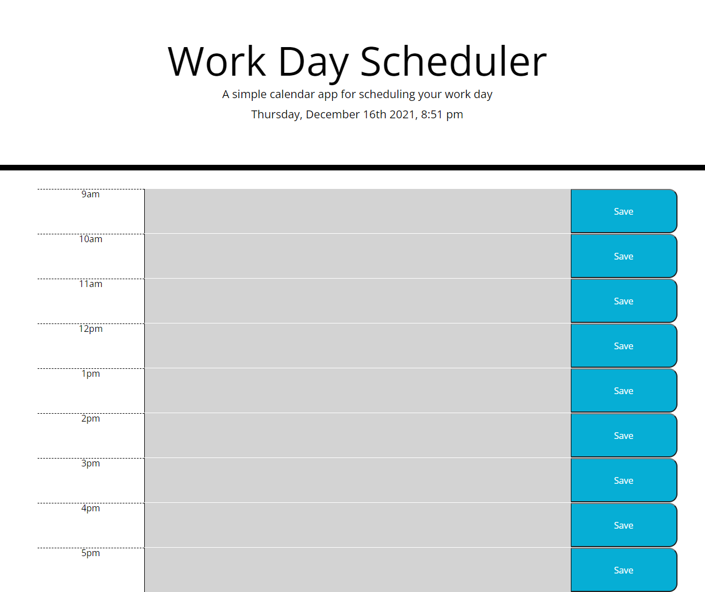
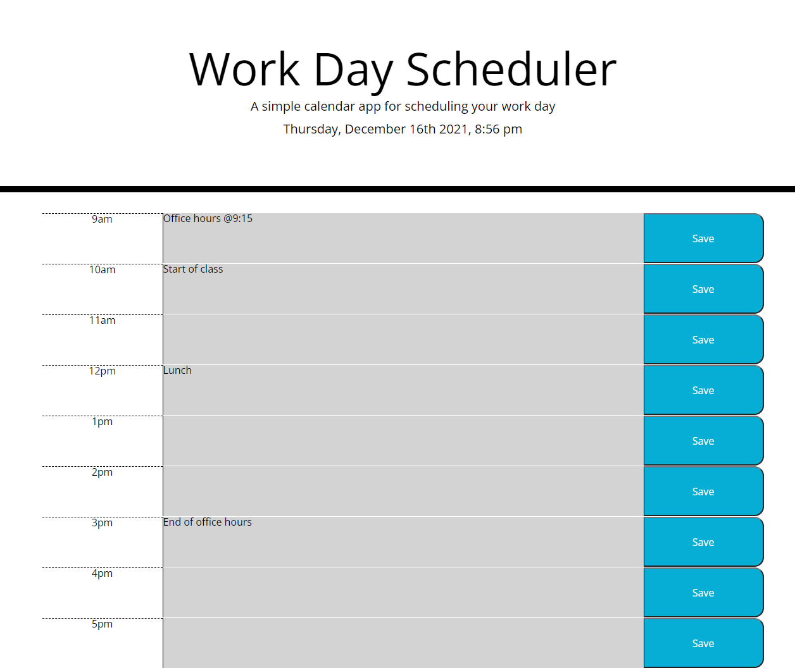
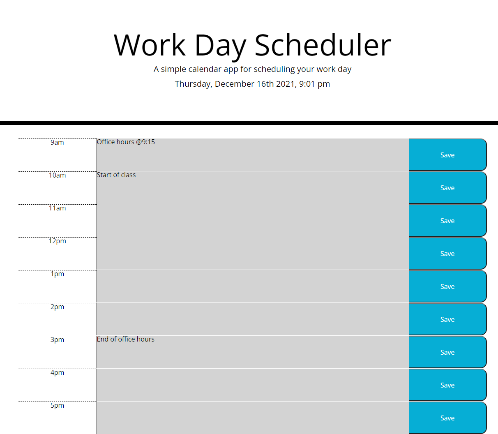
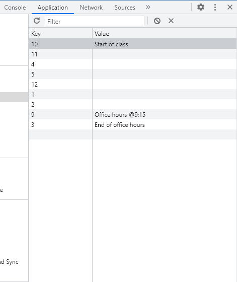
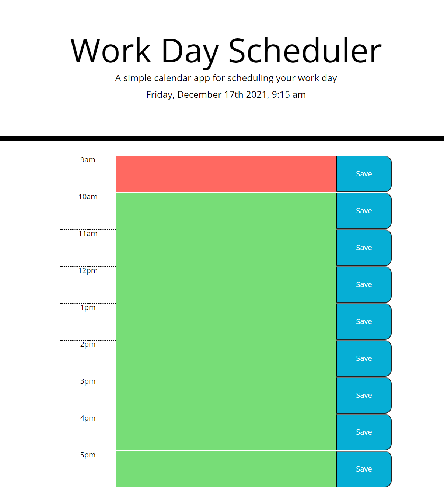

# day-planner

## Description
The goal was to create a dynamic and editable work day scheduler. This scheudler can be used to track and plan for tasks throughout the day. The time blocks are color coded based on the current time, allowing the see what is upcoming, what they should work on, or what has passed. The columns are editible, so future events can be added/removed. Past and present activities are also able to be removed. The activities are stored locally, so if the page is refreshed or closed, the tasks are not lost. While working on this, I learned how to use some of the JQuery syntax. I also improved my understanding of traversing the DOM via the console. I also understand when and when not to use parameters for functions more. 

## Table of Contents (Optional)
- [Installation](#installation)
- [Usage](#usage)
- [Credits](#credits)
- [License](#license)
- [Features](#features)
- [Tests](#tests)

## Installation
N/A

## Usage
Here is a link to the deployed Work Day Scheduler. [work-day-scheduler](https://maxstump13.github.io/day-planner/)

When the page is loaded, this is the planner will appear as seen below. Depending on the time, the blocks will be colored differently.

If a the text area is clicked, the user is able to add tasks for each hour. 

I added four tasks/events to different text areas of my planner as seen above. However, I didn't save lunch at 12 pm. If the page is refreshed, that text area will appear empty as seen below. 

If you use google chrome's dev tools, it displays the stored items on the page. Shown below, you can see that lunch at 12 was not stored locally.
.

Because the time I took the screenshots, I was unable to show the different background of the color blocks. I will add them the morning of 12/17 to show the differences.

Below is a picutre of the work day planner at 9:15 am. The current time block is colored red and future time blocks are green. 

## Credits
1. [MDN](https://developer.mozilla.org/en-US/)
2. [Kirupa](https://www.kirupa.com/)
3. [JQuery](https://jquery.com/)
4. [Geekwall](https://school.geekwall.in/)
5. [Moment](https://momentjs.com/)
6. [Youtube](https://www.youtube.com/watch?v=VlWsJHsVb-E)
7. [W3](https://www.w3schools.com/)
8. [Coderedirect](https://coderedirect.com/)
9. [Stackoverflow](https://stackoverflow.com/)

## License
[License](./LICENSE)

## Badges
N/A

## Features
1. An accurate current date/time display
2. Editible textarea for tasks to be added/removed for each hour of the work day
3. functional save button for local storage
4. bootstrap container/rows/columns for accurate and logical spacing
5. Current time comparison to color coordinate past, present , and future time blocks
6. Use of JQuery 
7. Various functions/methods to aid readibility

## How to Contribute
If there are any suggestions to improve this generator, this is my [GitHub](https://github.com/MaxStump13) account. 

## Tests
I tested the functionality of the save button in a few ways. I added text to a textarea saved it and refreshed. I added text to a textarea and hit a different save button, and refreshed. As expected, it wasn't stored. I deleted the text and saved, then I refreshed and it was empty. I also used the dev tools to check the keys and values were being stored properly. I also have worked on the planner at different times of day, verifying the background color for past, present, and future are working correctly.
